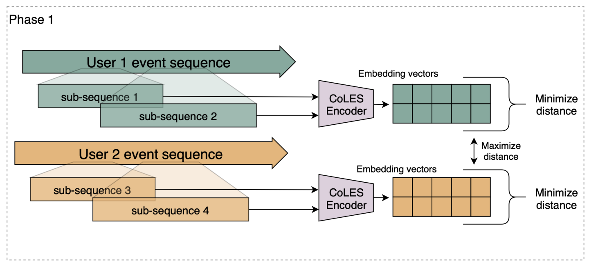

# LightCoLES
My PyTorch implementation of CoLES: Contrastive Learning for Event Sequences with Self-Supervision from AIRI and Sber AI Lab researchers.
*Original paper: https://arxiv.org/pdf/2002.08232*

The core idea of CoLES is to train an encoder for event sequences described by a set of categorical and numerical features. 
The encoder outputs a representative vector (embedding) that captures the essential characteristics of the event sequence. 
These embeddings can then be used in downstream tasks, such as:
        1. Transaction fraud detection
        2. Additional features for recommendation systems
        3. Classification or regression tasks

*General framework. Phase 1: Self-supervised training.*

---
